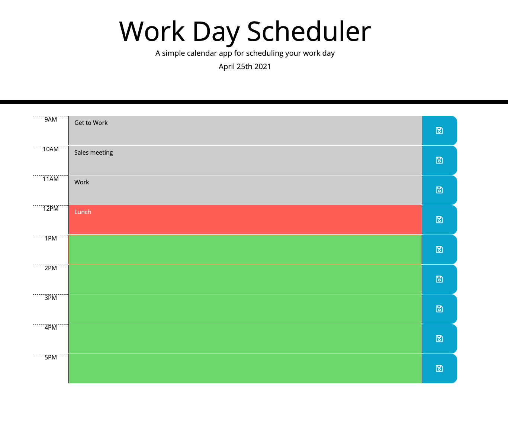

# Work-day-Scheduler

## description 
this is a day schedule web page that give you time slots where you can put your work tasks.
The color of each time slot changes based on what time it is.

## functionality 

* **Grey** is for tasks that already past
* **Red** is for the current task
* **Green** is for future tasks

### Saving 

1. Input a task into the appropriate time slot and click the save icon.
2. The task will be saved and will remain in the slot even iff you close or refresh the page
3. To remove a task you just erase and click the save button
4. to replace a task just put the new task in the slot and click save